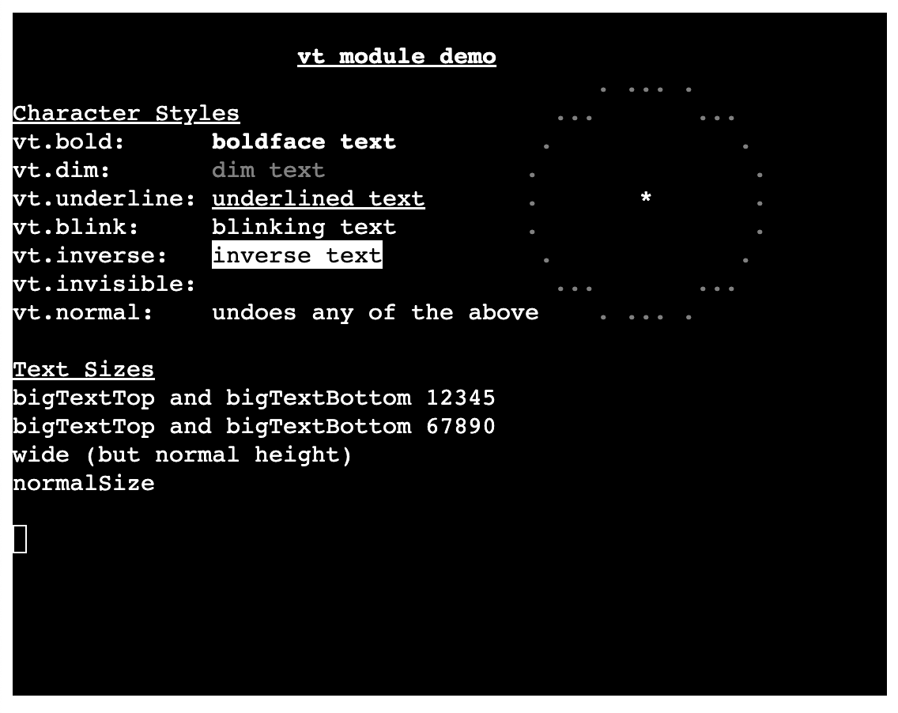

# MiniScript Web-Terminal

MiniScript terminal for the Web.



It allows you to write [MiniScript](https://miniscript.org/) programs that run on a web-terminal. Intrinsics like `print` and `input` interact directly with the terminal. 

The terminal component is [xterm.js](http://xtermjs.org/). As such it supports all [escape sequences](http://xtermjs.org/docs/api/vtfeatures/) that xterm.js is capable of.

The [MiniScript implementation](https://github.com/sebnozzi/miniscript.ts) is extended to supports module `import` (either local modules or "lib" modules). Included are the [same modules](https://github.com/JoeStrout/miniscript/tree/master/MiniScript-cpp/lib) as "command-line" MiniScript.

## Usage

Download one of the latest [releases](https://github.com/sebnozzi/miniscript-web-term/releases) (the file `miniscript-web-term.zip`).

It consists of an "index.html" page and additional files / folders, among them the "lib" folder with "command-line" MiniScript modules.

Put your MiniScript files directly in the root folder or under a sub-folder of your choice.

Change "data-src-file" in "index.html" (on the "body" element) to point to
the entry file of your program.

For example, if you put it in the root folder it would read:

```html
<body data-src-file="myProgram.ms">
```

And if you put it in a sub-folder it would read:

```html
<body data-src-file="src/myProgram.ms">
```

You can then serve the contents locally (e.g. with `python3 -m http.server 8000`) or zip them and upload somewhere (e.g. to itch.io).

Feel free to explore the [example folder](./example) folder. You might want to remove it before publishing.

## Publishing

In order to "publish" a project (e.g. to [itch.io](https://www.itch.io)) you probably need to create a zip file containing the following:

* index.html
* the "dist/" folder
* the "lib/" folder (to use built-in modules)
* any other files / folders that your project uses
  (in particular your MiniScript source files)

Remember to adapt "index.html" accordingly.

## Terminal Options

You can set / change the terminal options by declaring a (window) global `terminalOptions` variable according to the [ITerminalOptions](https://xtermjs.org/docs/api/terminal/interfaces/iterminaloptions/) and [ITerminalInitOnlyOptions](https://xtermjs.org/docs/api/terminal/interfaces/iterminalinitonlyoptions/) interfaces.

For example:

```javascript
window.terminalOptions = {
  theme: {
    background: "#191A19",
    foreground: "#F5F2E7",
  },
  fontSize: 16,
  cursorStyle: "block"
};
```

The included "index.html" already sets some options, so that you only need to adapt them as needed. 

You can even remove the whole "script" section. In that case the default options will apply.

## Building from source

To build from source make sure you have [Node.js](https://nodejs.org) installed.

Then from the project's root folder:

```
npm install
npm run build
```

Once build you can serve the contents locally.

## Serve locally

To serve locally, your could use Python's built-in web-server:

```
python3 -m http.server 8000
```

Alternatively you could consider either of these:

* https://www.npmjs.com/package/local-web-server
* https://www.npmjs.com/package/http-server
* https://caddyserver.com/
